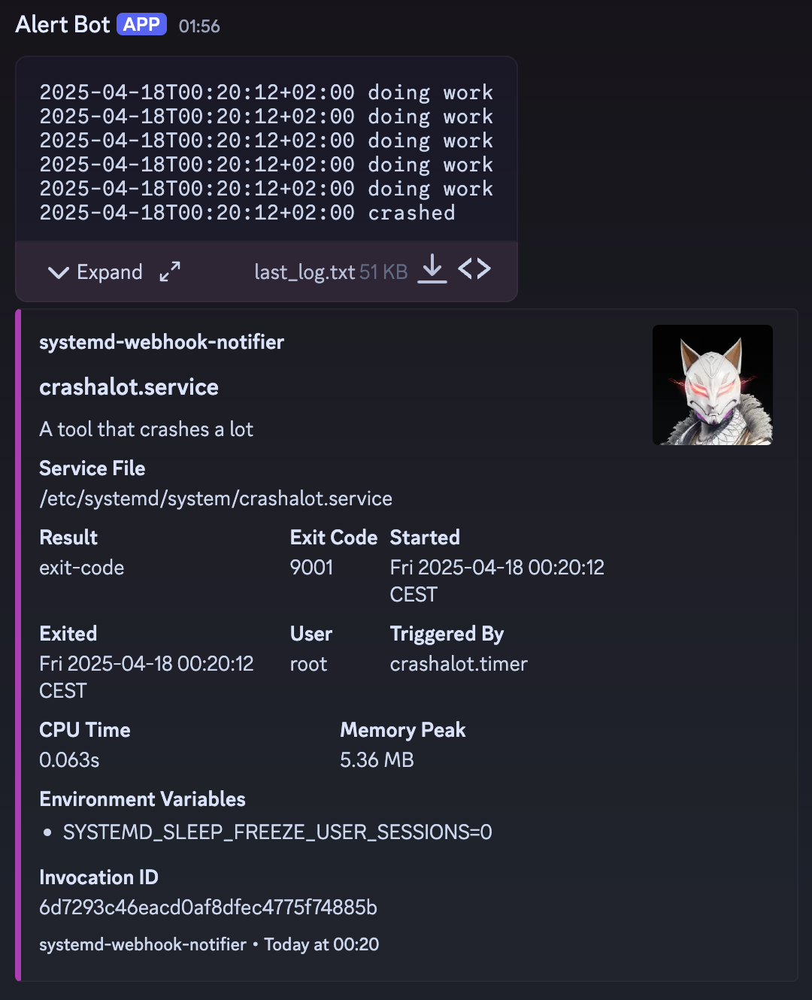

# systemd-webhook-notifier

This is a small tool that enables systemd unit `OnFailure=` reporting via webhooks.\
I made this because I couldn't be bothered to set up sendmail.

## Setup

### Building

Build the project and move the resulting binary somewhere that's generally accessible, for example `/usr/local/bin`:

```
cargo build --release && sudo mv ./target/release/notifier /usr/local/bin/
```

### Preparing a new service file

You'll need to create a service file for the notifier so it can be used in unit files. Store the following at `/etc/systemd/system/notifier@.service`.\
(The @ is important because this is an [*instantiated* service](https://www.freedesktop.org/software/systemd/man/latest/systemd.service.html#Service%20Templates)!)

```
[Unit]
Description=Sends the log for a unit's last invocation to a configurable webhook

[Service]
Type=simple
User=root
ExecStart=/usr/local/bin/notifier discord %I
EnvironmentFile=/usr/local/share/notifier/%I.env
SyslogIdentifier=notifier
SyslogFacility=user

[Install]
WantedBy=default.target
```

**Note:** `notifier` generally does *not* require root privileges, so feel free to change the `User=` line to something more restrictive.

### Preparing environment files

You'll also need a file containing at minimum the webhook URL that alerts should be sent to.

For the `discord` command, you may also specify an embed color and a thumbnail.

Put this into a file in a location that's as accessible as the `notifier` binary. One good example is `/usr/local/share/notifier/`.

```env
DISCORD_WEBHOOK=https://discord.com/api/webhooks/[redacted]
DISCORD_THUMBNAIL=https://example.com/thumbnail.png
DISCORD_COLOR=0xFF00FF
```

The name of the file depends on what you put into the above unit file's `EnvironmentFile=` line. If you want to watch a unit named `example.service`, name this file `example.service.env`.

### Setting up unit failure alerts

Simply add `OnFailure=notifier@%n.service` to the `[Unit]` block of the unit whose failures you want to be notified about.

If you've specified a webhook in the corresponding .env file, you'll receive an alert kinda like this:

